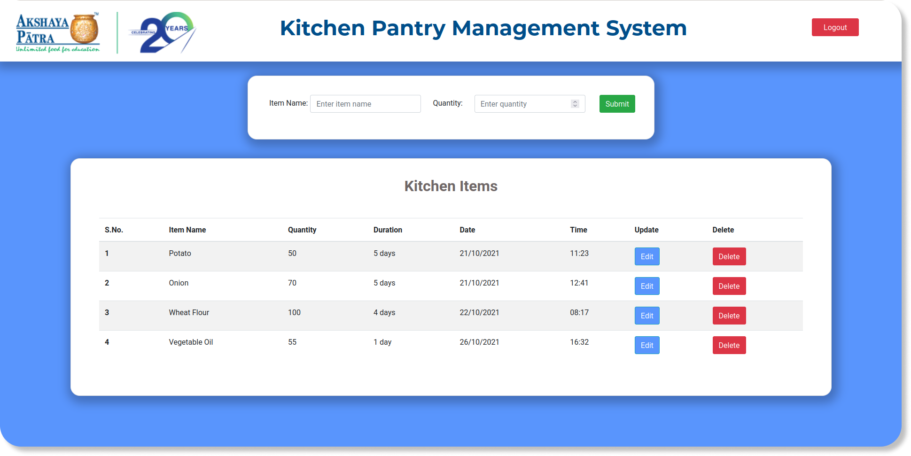

# Kitchen Pantry Management System (TAPF) 
<h4 align="justify"> The main objective of this project is to implement a management system for Akshaya Patra Kitchens. A system that allows the Kitchen Administrator to carry out operations such as Pantry Item registrations, Recording the Quantity, Expiry Information, Date and Time the item was bought. All these activities takeout manually by the Kitchen Administrator. </h4>

 

## About TAPF
<h4 align="justify"> The Akshaya Patra Foundation is a non-profit organisation in India that operates a mid-day meal programme. The organisation was established in 2000. The organisation strives to eliminate classroom hunger by implementing the Mid-Day Meal Scheme in the government schools and government-aided schools. </h4>

 

